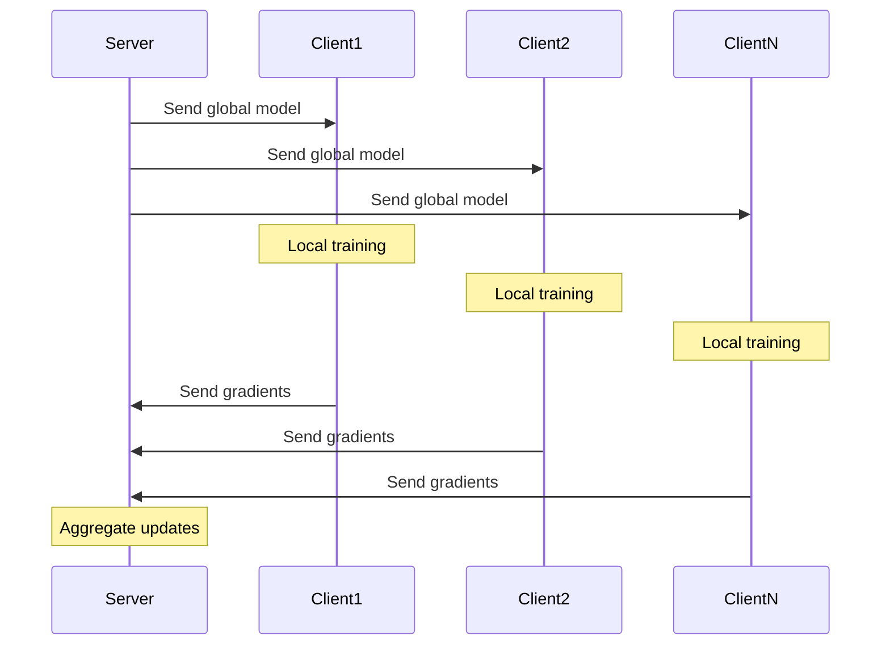

---
{"dg-publish":true,"permalink":"/30-knowledge/stats/04-supervised-learning/federated-learning/","tags":["machine-learning","supervised","privacy","distributed"]}
---

## Definition

> [!abstract] Core Statement
> **Federated Learning** is a machine learning approach where a model is trained across ==multiple decentralized devices or servers holding local data samples==, without exchanging the raw data. Only model updates (gradients) are shared.

---

> [!tip] Intuition (ELI5): The Collaborative Study Group
> Imagine 100 students each studying from their own textbooks at home. Instead of sharing their textbooks (private data), they each solve problems and share only their *learning notes* (gradients). A teacher combines all notes to create master study materials (global model).

---

## Purpose

1. **Privacy preservation:** Raw data never leaves the device
2. **Regulatory compliance:** GDPR, HIPAA requirements
3. **Reduce data transfer costs:** Only send gradients, not data
4. **Leverage distributed data:** Use data that can't be centralized

---

## When to Use

> [!success] Use Federated Learning When...
> - Data is **privacy-sensitive** (medical, financial)
> - Data is **distributed** across many devices (mobile phones)
> - **Regulations** prevent data centralization
> - Network bandwidth is limited

---

## When NOT to Use

> [!danger] Do NOT Use Federated Learning When...
> - Data can be safely centralized
> - Devices have **very limited compute** (use simpler methods)
> - **Non-IID data** distribution is too extreme
> - Low latency requirements

---

## How It Works

### The FedAvg Algorithm

```
1. Server initializes global model θ
2. For each round t = 1, 2, ...:
   a. Server sends θ_t to K random clients
   b. Each client k:
      - Trains on local data for E epochs
      - Computes update: Δθ_k = θ_local - θ_t
   c. Server aggregates: θ_{t+1} = θ_t + (1/K) Σ Δθ_k
3. Repeat until convergence
```

### Diagram



---

## Key Challenges

| Challenge | Description | Solution |
|-----------|-------------|----------|
| **Non-IID Data** | Clients have different data distributions | FedProx, personalization |
| **Communication Cost** | Many rounds of gradient exchange | Compression, local epochs |
| **Stragglers** | Slow clients delay aggregation | Async FL, client selection |
| **Privacy Attacks** | Gradients can leak info | Differential Privacy, Secure Aggregation |

---

## Python Implementation (Simplified)

```python
import numpy as np
from sklearn.linear_model import SGDClassifier
from sklearn.datasets import make_classification

# Simulate 5 clients with local data
np.random.seed(42)
n_clients = 5
client_data = []
for i in range(n_clients):
    X, y = make_classification(n_samples=200, n_features=10, random_state=i)
    client_data.append((X, y))

# Federated Averaging (simplified)
def federated_avg(client_data, rounds=10):
    # Initialize global model
    global_model = SGDClassifier(loss='log_loss', max_iter=1, warm_start=True)
    
    # Initial fit on dummy data
    X_init, y_init = client_data[0]
    global_model.fit(X_init[:1], y_init[:1])
    
    for round in range(rounds):
        client_coefs = []
        client_intercepts = []
        
        for X_local, y_local in client_data:
            # Clone global model to local
            local_model = SGDClassifier(loss='log_loss', max_iter=5)
            local_model.coef_ = global_model.coef_.copy()
            local_model.intercept_ = global_model.intercept_.copy()
            local_model.classes_ = global_model.classes_
            
            # Local training
            local_model.partial_fit(X_local, y_local)
            
            client_coefs.append(local_model.coef_)
            client_intercepts.append(local_model.intercept_)
        
        # Aggregate (FedAvg)
        global_model.coef_ = np.mean(client_coefs, axis=0)
        global_model.intercept_ = np.mean(client_intercepts, axis=0)
        
        print(f"Round {round+1}: Aggregated {n_clients} clients")
    
    return global_model

model = federated_avg(client_data, rounds=5)
```

---

## Real-World Applications

| Application | Example |
|-------------|---------|
| **Mobile Keyboards** | Google Gboard learns from typing without uploading text |
| **Healthcare** | Hospitals train models without sharing patient data |
| **Finance** | Banks detect fraud collaboratively |
| **IoT** | Edge devices learn collectively |

---

## Limitations

> [!warning] Pitfalls
> 1. **Non-IID data:** Performance degrades when client data is heterogeneous
> 2. **Communication bottleneck:** Many rounds needed for convergence
> 3. **Privacy is not guaranteed:** Gradient attacks can reconstruct data
> 4. **System heterogeneity:** Different device capabilities

---

## Related Concepts

- [[30_Knowledge/Stats/04_Supervised_Learning/Privacy-Preserving ML\|Privacy-Preserving ML]] - Broader category
- [[30_Knowledge/Stats/10_Ethics_and_Biases/Differential Privacy\|Differential Privacy]] - Privacy guarantees
- Distributed Computing - Infrastructure
- [[30_Knowledge/Stats/04_Supervised_Learning/Gradient Descent\|Gradient Descent]] - Core optimization

---

## R Implementation

```r
# Federated Learning in R
set.seed(42)

# Example implementation
data <- rnorm(100)
summary(data)
```

---

## References

1. McMahan, B., et al. (2017). Communication-Efficient Learning of Deep Networks from Decentralized Data. *AISTATS*. [arXiv](https://arxiv.org/abs/1602.05629)

2. Kairouz, P., et al. (2021). Advances and Open Problems in Federated Learning. *Foundations and Trends in ML*. [arXiv](https://arxiv.org/abs/1912.04977)

3. Li, T., et al. (2020). Federated Optimization in Heterogeneous Networks (FedProx). *MLSys*. [arXiv](https://arxiv.org/abs/1812.06127)
