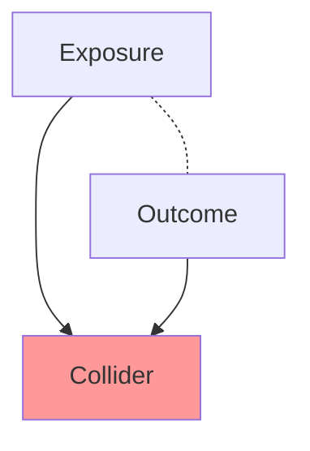

---
{"dg-publish":true,"permalink":"/30-knowledge/stats/07-causal-inference/collider-bias/","tags":["causal-inference"]}
---


## Definition

> [!abstract] Core Statement
> **Collider Bias** occurs when you condition on (control for, stratify by, or select based on) a variable that is ==caused by both== the exposure and the outcome (or their causes). This creates a spurious association even when none exists.

---

> [!tip] Intuition (ELI5): The Hollywood Paradox
> Why do beautiful actors seem less talented? Because both talent AND beauty open doors to Hollywood. Among successful actors (conditioning on the collider "success"), if someone isn't beautiful, they must be talented to have made it — creating a negative correlation that doesn't exist in the general population.

---

## The Mechanism

### DAG Representation



**Key insight:** X and Y are independent. But once you condition on C, information about X tells you something about Y.

### Mathematical Intuition

If both X and Y cause C:
- Knowing C and X → You can infer something about Y
- This creates correlation between X and Y **within strata of C**

---

## Classic Examples

### 1. Berkson's Paradox (Hospital Setting)

| Variable | Role |
|----------|------|
| Disease A | Exposure |
| Disease B | Outcome |
| Hospitalization | Collider |

**Problem:** Both diseases independently cause hospitalization. Among hospitalized patients, Disease A and B appear negatively correlated (if you have A, you're less likely to also have B, since you'd already be hospitalized).

### 2. The Obesity Paradox

Among diabetics, obesity seems protective against mortality. But:
- Obesity → Diabetes (selection into the group)
- Other factors → Diabetes (selection)
- Conditioning on "being diabetic" (collider) creates bias

### 3. Low Birth Weight Paradox

Maternal smoking seems protective among low birth weight babies:
- Smoking → Low birth weight
- Birth defects → Low birth weight
- Conditioning on low birth weight creates spurious protective effect

---

## When Collider Bias Occurs

> [!failure] You Create Collider Bias When...
> - **Selecting on outcome:** Studying only diseased patients
> - **Controlling for consequence:** Adjusting for a variable caused by exposure
> - **Loss to follow-up:** If dropout is caused by both exposure and outcome
> - **Stratifying by intermediate:** Analyzing within levels of a mediator

> [!success] Safe Practices
> - Draw a DAG before analysis
> - Identify all colliders
> - Never condition on colliders (except in special designs)

---

## Python Simulation

```python
import numpy as np
import pandas as pd
import matplotlib.pyplot as plt
from scipy import stats

# ========== SIMULATE COLLIDER BIAS ==========
np.random.seed(42)
n = 10000

# Independent causes
talent = np.random.normal(0, 1, n)
beauty = np.random.normal(0, 1, n)

# Collider: Hollywood success (caused by both)
success_prob = 1 / (1 + np.exp(-(talent + beauty - 2)))  # High bar
hollywood_success = np.random.binomial(1, success_prob)

df = pd.DataFrame({
    'Talent': talent,
    'Beauty': beauty,
    'Success': hollywood_success
})

# ========== TRUE CORRELATION (Full Population) ==========
r_full, p_full = stats.pearsonr(df['Talent'], df['Beauty'])
print(f"Full Population: r = {r_full:.3f}, p = {p_full:.4f}")

# ========== COLLIDER BIAS (Only Successful) ==========
df_success = df[df['Success'] == 1]
r_biased, p_biased = stats.pearsonr(df_success['Talent'], df_success['Beauty'])
print(f"Among Successful Only: r = {r_biased:.3f}, p = {p_biased:.4f}")

# ========== VISUALIZATION ==========
fig, axes = plt.subplots(1, 2, figsize=(12, 5))

axes[0].scatter(df['Talent'], df['Beauty'], alpha=0.3, s=10)
axes[0].set_xlabel('Talent')
axes[0].set_ylabel('Beauty')
axes[0].set_title(f'Full Population\n(r = {r_full:.3f})')

axes[1].scatter(df_success['Talent'], df_success['Beauty'], alpha=0.3, s=10, color='red')
axes[1].set_xlabel('Talent')
axes[1].set_ylabel('Beauty')
axes[1].set_title(f'Hollywood Actors Only\n(r = {r_biased:.3f}, BIASED!)')

plt.tight_layout()
plt.show()
```

---

## R Implementation

```r
set.seed(42)
n <- 10000

# Independent causes
talent <- rnorm(n)
beauty <- rnorm(n)

# Collider: Hollywood success
success_prob <- plogis(talent + beauty - 2)
success <- rbinom(n, 1, success_prob)

df <- data.frame(Talent = talent, Beauty = beauty, Success = success)

# ========== TRUE CORRELATION ==========
cor.test(df$Talent, df$Beauty)
# r ≈ 0 (independent)

# ========== COLLIDER BIAS ==========
df_success <- df[df$Success == 1, ]
cor.test(df_success$Talent, df_success$Beauty)
# r ≈ -0.5 (spurious negative correlation!)

# ========== VISUALIZATION ==========
library(ggplot2)

p1 <- ggplot(df, aes(Talent, Beauty)) +
  geom_point(alpha = 0.1) +
  labs(title = "Full Population (r ≈ 0)")

p2 <- ggplot(df_success, aes(Talent, Beauty)) +
  geom_point(alpha = 0.3, color = "red") +
  labs(title = "Successful Only (Collider Bias!)")

library(patchwork)
p1 + p2
```

---

## Detecting Collider Bias

### Signs of Potential Collider Bias

| Sign | Example |
|------|---------|
| **Selection into study** | "Among patients who..." |
| **Paradoxical findings** | Protective effect of known risk factor |
| **Results change with different populations** | Effect disappears in general sample |
| **Adjusting for post-exposure variable** | "Controlling for disease severity..." |

### What to Do

1. **Draw DAG:** Identify potential colliders
2. **Sensitivity Analysis:** Compare results with/without conditioning
3. **Use Appropriate Methods:** [[30_Knowledge/Stats/07_Causal_Inference/Inverse Probability Weighting\|Inverse Probability Weighting]] for selection bias
4. **Report Limitations:** Acknowledge potential collider bias

---

## Collider Bias vs Confounding

| Collider Bias | Confounding |
|---------------|-------------|
| Variable is **effect** of X and Y | Variable is **cause** of X and Y |
| Conditioning **creates** bias | Conditioning **removes** bias |
| DAG: X → C ← Y | DAG: X ← Z → Y |
| Solution: Don't condition | Solution: Condition on confounder |

---

## Common Pitfalls

> [!warning] Real-World Traps
>
> **1. "Controlling for Everything"**
> - *Problem:* Including all available variables in regression
> - *Reality:* Some are colliders, biasing results
> - *Solution:* Use DAG to guide variable selection
>
> **2. Studying Only Cases**
> - *Problem:* Case-only studies condition on disease status
> - *Example:* Gene-environment interaction studies among cases only
>
> **3. Missing Data as Collider**
> - *Problem:* Missingness depends on exposure and outcome
> - *Solution:* Multiple imputation or IPW for missing data

---

## Related Concepts

- [[30_Knowledge/Stats/07_Causal_Inference/DAGs for Causal Inference\|DAGs for Causal Inference]] — Visual tool for identifying colliders
- [[30_Knowledge/Stats/01_Foundations/Confounding Variables\|Confounding Variables]] — The other main source of bias
- [[30_Knowledge/Stats/10_Ethics_and_Biases/Selection Bias\|Selection Bias]] — Often involves collider conditioning
- [[30_Knowledge/Stats/07_Causal_Inference/Propensity Score Matching (PSM)\|Propensity Score Matching (PSM)]] — Can avoid if designed well

---

## When to Use

> [!success] Use Collider Bias When...
> - Refer to standard documentation
> - Refer to standard documentation

---

## When NOT to Use

> [!danger] Do NOT Use When...
> - Key assumptions cannot be verified
> - No valid control group available

---

## Python Implementation

```python
import numpy as np
import pandas as pd

# Example implementation of Collider Bias
# See documentation for details

data = np.random.randn(100)
print(f"Mean: {np.mean(data):.3f}")
print(f"Std: {np.std(data):.3f}")
```

---

## References

- **Article:** Hernán, M. A., Hernández-Díaz, S., & Robins, J. M. (2004). A structural approach to selection bias. *Epidemiology*, 15(5), 615-625. [DOI](https://doi.org/10.1097/01.ede.0000135174.63482.43)
- **Book:** Pearl, J. (2009). *Causality* (2nd ed.). Cambridge University Press.
- **Article:** Berkson, J. (1946). Limitations of the application of fourfold table analysis to hospital data. *Biometrics Bulletin*, 2(3), 47-53. [JSTOR](https://www.jstor.org/stable/3002000)
- **Article:** Cole, S. R., et al. (2010). Illustrating bias due to conditioning on a collider. *International Journal of Epidemiology*, 39(2), 417-420. [DOI](https://doi.org/10.1093/ije/dyp334)
