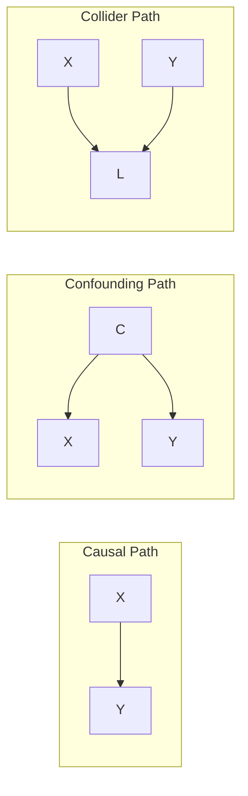
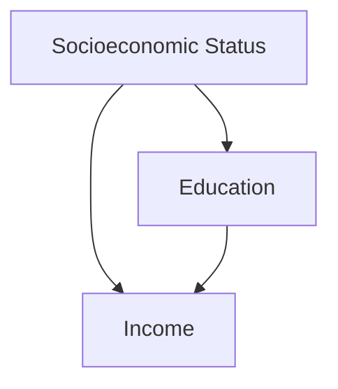
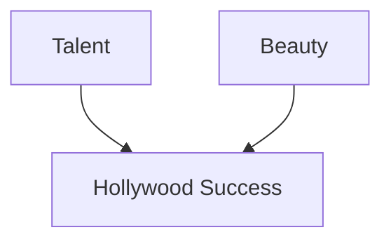

---
{"dg-publish":true,"permalink":"/30-knowledge/stats/07-causal-inference/da-gs-directed-acyclic-graphs/","tags":["causal-inference","graphical-models","confounding"]}
---

## Definition

> [!abstract] Core Statement
> A **Directed Acyclic Graph (DAG)** is a graphical representation of ==causal relationships between variables==. Nodes represent variables, directed edges represent causal effects, and the graph has no cycles (no variable can cause itself through a chain).

---

> [!tip] Intuition (ELI5): The Family Tree of Causation
> Like a family tree shows who is whose parent, a DAG shows which variable "causes" which. Arrows point from cause to effect. No time travel allowed (no cycles)!

---

## Purpose

1. **Visualize causal assumptions** explicitly
2. **Identify confounders** to control for
3. **Determine adjustment sets** for unbiased estimation
4. **Avoid bad controls** (mediators, colliders)

---

## Key Concepts

### Node Types

| Type | Symbol | Description |
|------|--------|-------------|
| **Exposure** | X | Treatment/predictor of interest |
| **Outcome** | Y | What we want to explain |
| **Confounder** | C | Causes both X and Y |
| **Mediator** | M | On causal path X → M → Y |
| **Collider** | L | Effect of two variables (← L →) |

### Path Types



---

## The Three Rules

### 1. Confounding (Fork)
```
    C
   / \
  ↓   ↓
  X   Y
```
**Problem:** X and Y are associated through C
**Solution:** Control for C

### 2. Mediation (Chain)
```
X → M → Y
```
**Problem:** Controlling for M blocks the causal effect
**Solution:** Don't control for M if you want total effect

### 3. Collider (Inverted Fork)
```
  X   Y
   \ /
    ↓
    L
```
**Problem:** X and Y are independent, but conditioning on L creates association
**Solution:** Don't control for L (collider bias)

---

## DAG Examples

### Example 1: Simple Confounding

To estimate Education → Income, control for SES.

### Example 2: Collider Bias

If you only study Hollywood stars, Talent and Beauty appear negatively correlated!

---

## Python Implementation (with DoWhy)

```python
import dowhy
from dowhy import CausalModel
import pandas as pd
import numpy as np

# Simulate data
np.random.seed(42)
n = 1000
C = np.random.normal(0, 1, n)  # Confounder
X = 0.5 * C + np.random.normal(0, 1, n)  # Treatment
Y = 0.3 * X + 0.7 * C + np.random.normal(0, 1, n)  # Outcome

df = pd.DataFrame({'C': C, 'X': X, 'Y': Y})

# Define causal graph
model = CausalModel(
    data=df,
    treatment='X',
    outcome='Y',
    graph="""
    digraph {
        C -> X;
        C -> Y;
        X -> Y;
    }
    """
)

# Visualize
model.view_model()

# Identify effect
identified_estimand = model.identify_effect()
print(identified_estimand)

# Estimate effect
estimate = model.estimate_effect(
    identified_estimand,
    method_name="backdoor.linear_regression"
)
print(f"Causal effect: {estimate.value:.3f}")
print(f"True effect: 0.3")
```

---

## Backdoor Criterion

A set of variables Z satisfies the **backdoor criterion** if:
1. No node in Z is a descendant of X
2. Z blocks all backdoor paths from X to Y

**If satisfied:** Controlling for Z gives unbiased causal effect.

---

## Common Mistakes

| Mistake | Problem |
|---------|---------|
| Control for mediator | Blocks causal path, underestimates effect |
| Control for collider | Opens spurious path, biased estimate |
| Missing confounder | Unblocked backdoor path |
| Control for descendant of outcome | Collider bias |

---

## Tools for DAGs

| Tool | Language | Link |
|------|----------|------|
| **DAGitty** | Web | [dagitty.net](http://dagitty.net) |
| **DoWhy** | Python | [Microsoft](https://github.com/py-why/dowhy) |
| **ggdag** | R | [CRAN](https://cran.r-project.org/package=ggdag) |
| **CausalNex** | Python | [QuantumBlack](https://github.com/quantumblacklabs/causalnex) |

---

## Limitations

> [!warning] Pitfalls
> 1. **Assumptions untestable:** Can't verify from data alone
> 2. **Incomplete graph:** Missing variables lead to bias
> 3. **No cycles:** Can't represent feedback loops directly
> 4. **Requires domain knowledge:** Must know causal structure

---

## Related Concepts

- [[30_Knowledge/Stats/07_Causal_Inference/Causal Inference\|Causal Inference]] - Broader framework
- [[30_Knowledge/Stats/01_Foundations/Confounding Variables\|Confounding Variables]] - Key concept DAGs help identify
- [[30_Knowledge/Stats/07_Causal_Inference/Propensity Score Matching (PSM)\|Propensity Score Matching (PSM)]] - Uses DAG for variable selection
- [[30_Knowledge/Stats/10_Ethics_and_Biases/Simpson's Paradox\|Simpson's Paradox]] - Can be explained with DAGs

---

## When to Use

> [!success] Use DAGs (Directed Acyclic Graphs) When...
> - Refer to standard documentation
> - Refer to standard documentation

---

## When NOT to Use

> [!danger] Do NOT Use When...
> - Key assumptions cannot be verified
> - No valid control group available

---

## R Implementation

```r
# DAGs (Directed Acyclic Graphs) in R
set.seed(42)

# Example implementation
data <- rnorm(100)
summary(data)
```

---

## References

1. Pearl, J. (2009). *Causality: Models, Reasoning, and Inference* (2nd ed.). Cambridge. [Book](http://bayes.cs.ucla.edu/BOOK-2K/)

2. Pearl, J., & Mackenzie, D. (2018). *The Book of Why*. Basic Books.

3. Hernán, M. A., & Robins, J. M. (2020). *Causal Inference: What If*. Chapman & Hall. [Free PDF](https://www.hsph.harvard.edu/miguel-hernan/causal-inference-book/)
