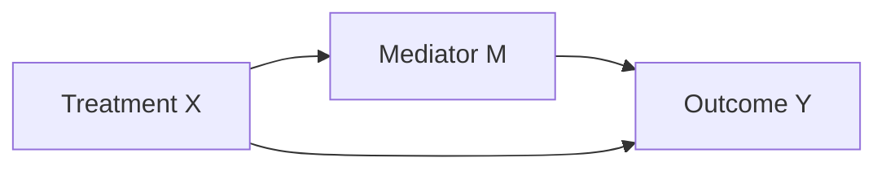
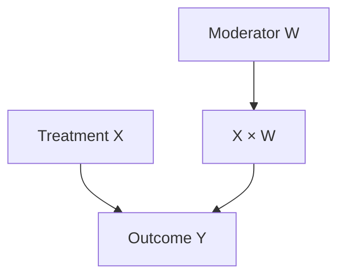

---
{"dg-publish":true,"permalink":"/30-knowledge/stats/07-causal-inference/mediation-and-moderation-analysis/","tags":["causal-inference","mechanisms","regression"]}
---

## Definition

> [!abstract] Core Statement
> **Mediation** explains ==*how*== an effect occurs (the mechanism), while **Moderation** explains ==*when*== or *for whom* the effect varies (boundary conditions).

---

> [!tip] Intuition (ELI5)
> - **Mediation:** "Exercise reduces stress *through* better sleep." (Sleep is the *how*)
> - **Moderation:** "Exercise reduces stress, but *only for* people under 40." (Age is the *when*)

---

## Key Difference

| Aspect | Mediation | Moderation |
|--------|-----------|------------|
| **Question** | How does X affect Y? | When does X affect Y? |
| **Variable role** | Mediator transmits effect | Moderator changes effect size |
| **Statistical test** | Indirect effect ≠ 0 | Interaction term ≠ 0 |

---

## Mediation Analysis

### The Model



### Paths

- **Direct effect (c'):** X → Y
- **Indirect effect (a×b):** X → M → Y
- **Total effect (c):** c = c' + a×b

### Baron & Kenny Steps (Classic)

1. X → Y is significant (c ≠ 0)
2. X → M is significant (a ≠ 0)
3. M → Y (controlling for X) is significant (b ≠ 0)
4. X → Y (controlling for M) is reduced (c' < c)

### Modern Approach: Bootstrapping

```python
import numpy as np
import pandas as pd
from scipy import stats
import statsmodels.api as sm

# Simulate data
np.random.seed(42)
n = 200
X = np.random.normal(0, 1, n)
M = 0.5 * X + np.random.normal(0, 0.5, n)  # a = 0.5
Y = 0.3 * X + 0.6 * M + np.random.normal(0, 0.5, n)  # c' = 0.3, b = 0.6

# Path a: X -> M
a_model = sm.OLS(M, sm.add_constant(X)).fit()
a = a_model.params[1]

# Path b and c': M -> Y controlling for X
X_M = sm.add_constant(pd.DataFrame({'X': X, 'M': M}))
b_model = sm.OLS(Y, X_M).fit()
b = b_model.params['M']
c_prime = b_model.params['X']

# Indirect effect
indirect = a * b
print(f"Path a: {a:.3f}")
print(f"Path b: {b:.3f}")
print(f"Direct effect (c'): {c_prime:.3f}")
print(f"Indirect effect (a*b): {indirect:.3f}")

# Bootstrap CI for indirect effect
def bootstrap_indirect(X, M, Y, n_boot=5000):
    indirect_effects = []
    n = len(X)
    for _ in range(n_boot):
        idx = np.random.choice(n, n, replace=True)
        X_b, M_b, Y_b = X[idx], M[idx], Y[idx]
        a = sm.OLS(M_b, sm.add_constant(X_b)).fit().params[1]
        b = sm.OLS(Y_b, sm.add_constant(pd.DataFrame({'X': X_b, 'M': M_b}))).fit().params['M']
        indirect_effects.append(a * b)
    return np.percentile(indirect_effects, [2.5, 97.5])

ci = bootstrap_indirect(X, M, Y)
print(f"95% CI for indirect effect: [{ci[0]:.3f}, {ci[1]:.3f}]")
```

---

## Moderation Analysis

### The Model



### Regression Equation

$$
Y = \beta_0 + \beta_1 X + \beta_2 W + \beta_3 (X \times W) + \varepsilon
$$

**$\beta_3$ ≠ 0** → Moderation exists

### Python Implementation

```python
import numpy as np
import statsmodels.api as sm

# Simulate data
np.random.seed(42)
n = 200
X = np.random.normal(0, 1, n)
W = np.random.normal(0, 1, n)  # Moderator
Y = 2 + 0.5*X + 0.3*W + 0.8*(X*W) + np.random.normal(0, 1, n)

# Create interaction term
data = pd.DataFrame({'X': X, 'W': W, 'XW': X*W, 'Y': Y})

# Fit model
model = sm.OLS.from_formula('Y ~ X + W + X:W', data=data).fit()
print(model.summary().tables[1])

# Simple slopes at different W values
for w_val in [-1, 0, 1]:
    slope = model.params['X'] + model.params['X:W'] * w_val
    print(f"Effect of X when W={w_val}: {slope:.3f}")
```

---

## Interpretation Guide

### Mediation

| Finding | Interpretation |
|---------|----------------|
| Indirect effect CI excludes 0 | Significant mediation |
| c' ≈ 0 but a×b ≠ 0 | Full mediation |
| c' ≠ 0 and a×b ≠ 0 | Partial mediation |

### Moderation

| Finding | Interpretation |
|---------|----------------|
| $\beta_3 > 0$ | Effect of X increases with W |
| $\beta_3 < 0$ | Effect of X decreases with W |
| $\beta_3 = 0$ | No moderation |

---

## Limitations

> [!warning] Pitfalls
> 1. **Mediation requires causality:** Temporal ordering matters (X before M before Y)
> 2. **Unmeasured confounders:** Can bias indirect effects
> 3. **Moderation multicollinearity:** Center variables before creating interactions
> 4. **Power:** Detecting interactions requires larger samples

---

## Related Concepts

- [[30_Knowledge/Stats/07_Causal_Inference/Causal Inference\|Causal Inference]] - Broader framework
- [[30_Knowledge/Stats/07_Causal_Inference/DAGs (Directed Acyclic Graphs)\|DAGs (Directed Acyclic Graphs)]] - Visual representation
- [[30_Knowledge/Stats/07_Causal_Inference/Regression Discontinuity Design (RDD)\|Regression Discontinuity Design (RDD)]] - Alternative causal method
- [[30_Knowledge/Stats/03_Regression_Analysis/Interaction Effects\|Interaction Effects]] - Statistical concept

---

## When to Use

> [!success] Use Mediation and Moderation Analysis When...
> - Refer to standard documentation
> - Refer to standard documentation

---

## When NOT to Use

> [!danger] Do NOT Use When...
> - Key assumptions cannot be verified
> - No valid control group available

---

## R Implementation

```r
# Mediation and Moderation Analysis in R
set.seed(42)

# Example implementation
data <- rnorm(100)
summary(data)
```

---

## References

1. Baron, R. M., & Kenny, D. A. (1986). The moderator-mediator variable distinction. *JPSP*. [APA](https://psycnet.apa.org/record/1987-13085-001)

2. Hayes, A. F. (2017). *Introduction to Mediation, Moderation, and Conditional Process Analysis* (2nd ed.). Guilford. [Book](http://www.guilford.com/books/Introduction-to-Mediation-Moderation-and-Conditional-Process-Analysis/Andrew-Hayes/9781462534654)

3. Preacher, K. J., & Hayes, A. F. (2008). Asymptotic and resampling strategies for assessing and comparing indirect effects. *Behavior Research Methods*. [Paper](https://link.springer.com/article/10.3758/BRM.40.3.879)
