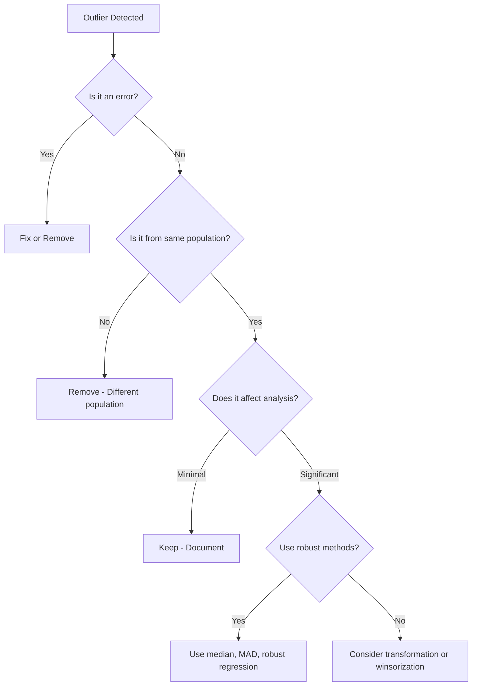

---
{"dg-publish":true,"permalink":"/30-knowledge/stats/09-eda-and-visualization/outlier-detection/","tags":["eda","visualization","data-quality","preprocessing"]}
---

## Definition

> [!abstract] Core Statement
> **Outlier Detection** is the process of identifying data points that ==deviate significantly from the majority== of observations. Outliers may represent errors, rare events, or important anomalies worth investigating.

---

> [!tip] Intuition (ELI5): The Different Kid in Class
> In a class of students aged 10-11, one kid is 25 years old. That's an outlier! It could be a typo (error), a teacher (different population), or an actual unusual case worth investigating.

---

## Purpose

1. **Data Quality:** Identify data entry errors or sensor malfunctions
2. **Fraud Detection:** Unusual transactions may indicate fraud
3. **Scientific Discovery:** Outliers can reveal new phenomena
4. **Model Robustness:** Decide whether to remove or keep outliers

---

## Types of Outliers

| Type | Description | Example |
|------|-------------|---------|
| **Point Outliers** | Single anomalous value | Age = 300 years |
| **Contextual** | Abnormal in specific context | 30°C in January (unusual for some regions) |
| **Collective** | Group of values that are anomalous together | Sudden spike in network traffic |

---

## Detection Methods

### 1. Statistical Methods

#### Z-Score Method
$$
z_i = \frac{x_i - \bar{x}}{\sigma}
$$
Outlier if $|z| > 3$ (typically)

#### IQR Method (Tukey's Fences)
$$
\text{Outlier if } x < Q1 - 1.5 \times IQR \text{ or } x > Q3 + 1.5 \times IQR
$$

#### Modified Z-Score (Robust)
$$
M_i = \frac{0.6745 \times (x_i - \tilde{x})}{MAD}
$$
where $MAD$ = Median Absolute Deviation. Outlier if $|M| > 3.5$

### 2. Machine Learning Methods

| Method | Type | Best For |
|--------|------|----------|
| [[30_Knowledge/Stats/05_Unsupervised_Learning/Isolation Forest\|Isolation Forest]] | Unsupervised | High-dimensional data |
| [[30_Knowledge/Stats/05_Unsupervised_Learning/K-Means Clustering\|K-Means Clustering]] | Unsupervised | Cluster-based anomalies |
| LOF (Local Outlier Factor) | Unsupervised | Density-based anomalies |
| One-Class SVM | Unsupervised | Non-linear boundaries |

---

## Python Implementation

```python
import numpy as np
import pandas as pd
from scipy import stats

# Sample data with outliers
np.random.seed(42)
data = np.concatenate([
    np.random.normal(50, 10, 100),  # Normal data
    [150, 200, -50]  # Outliers
])
df = pd.DataFrame({'value': data})

# Method 1: Z-Score
df['z_score'] = np.abs(stats.zscore(df['value']))
z_outliers = df[df['z_score'] > 3]
print(f"Z-Score Outliers: {len(z_outliers)}")

# Method 2: IQR
Q1 = df['value'].quantile(0.25)
Q3 = df['value'].quantile(0.75)
IQR = Q3 - Q1
lower = Q1 - 1.5 * IQR
upper = Q3 + 1.5 * IQR
iqr_outliers = df[(df['value'] < lower) | (df['value'] > upper)]
print(f"IQR Outliers: {len(iqr_outliers)}")

# Method 3: Isolation Forest
from sklearn.ensemble import IsolationForest

iso = IsolationForest(contamination=0.03, random_state=42)
df['iso_outlier'] = iso.fit_predict(df[['value']])
iso_outliers = df[df['iso_outlier'] == -1]
print(f"Isolation Forest Outliers: {len(iso_outliers)}")

# Visualize
import matplotlib.pyplot as plt

fig, ax = plt.subplots(1, 2, figsize=(12, 4))

# Boxplot
ax[0].boxplot(df['value'])
ax[0].set_title('Boxplot (IQR Method)')

# Scatter with outliers highlighted
ax[1].scatter(range(len(df)), df['value'], c='blue', alpha=0.5, label='Normal')
ax[1].scatter(iqr_outliers.index, iqr_outliers['value'], c='red', s=100, label='Outliers')
ax[1].axhline(upper, color='red', linestyle='--', label='Upper fence')
ax[1].axhline(lower, color='red', linestyle='--', label='Lower fence')
ax[1].legend()
ax[1].set_title('Outlier Detection')

plt.tight_layout()
plt.show()
```

**Expected Output:**
```
Z-Score Outliers: 3
IQR Outliers: 3
Isolation Forest Outliers: 3
```

---

## R Implementation

```r
# Sample data
set.seed(42)
data <- c(rnorm(100, 50, 10), 150, 200, -50)

# IQR Method
Q1 <- quantile(data, 0.25)
Q3 <- quantile(data, 0.75)
IQR <- Q3 - Q1
lower <- Q1 - 1.5 * IQR
upper <- Q3 + 1.5 * IQR

outliers <- data[data < lower | data > upper]
print(paste("IQR Outliers:", length(outliers)))

# Boxplot (visual)
boxplot(data, main = "Outlier Detection", outcol = "red")

# Z-Score
z_scores <- scale(data)
z_outliers <- data[abs(z_scores) > 3]
print(paste("Z-Score Outliers:", length(z_outliers)))
```

---

## Decision Framework



---

## Handling Outliers

| Strategy | When to Use |
|----------|-------------|
| **Remove** | Clearly erroneous or from different population |
| **Transform** | Log, sqrt to reduce impact |
| **Winsorize** | Cap at percentiles (e.g., 1st and 99th) |
| **Robust Methods** | Use median, MAD, robust regression |
| **Keep & Document** | When outliers are genuine and important |

---

## Limitations

> [!warning] Pitfalls
> 1. **Context matters:** An "outlier" in one context may be normal in another
> 2. **Multivariate outliers:** Point may be normal on each variable but unusual in combination
> 3. **Masking:** One outlier can hide another
> 4. **Swamping:** Normal points flagged due to outlier influence on statistics

---

## Related Concepts

- [[30_Knowledge/Stats/09_EDA_and_Visualization/Boxplot\|Boxplot]] - Visual outlier detection
- [[30_Knowledge/Stats/05_Unsupervised_Learning/Isolation Forest\|Isolation Forest]] - ML-based detection
- [[30_Knowledge/Stats/04_Supervised_Learning/Anomaly Detection\|Anomaly Detection]] - Broader ML perspective
- Robust Statistics - Methods resistant to outliers

---

## When to Use

> [!success] Use Outlier Detection When...
> - Refer to standard documentation
> - Refer to standard documentation

---

## When NOT to Use

> [!danger] Do NOT Use When...
> - Assumptions are violated
> - Alternative methods are more appropriate

---

## References

1. Tukey, J. W. (1977). *Exploratory Data Analysis*. Addison-Wesley.

2. Hawkins, D. M. (1980). *Identification of Outliers*. Chapman and Hall.

3. Liu, F. T., Ting, K. M., & Zhou, Z. H. (2008). Isolation Forest. *ICDM*. [IEEE](https://ieeexplore.ieee.org/document/4781136)
