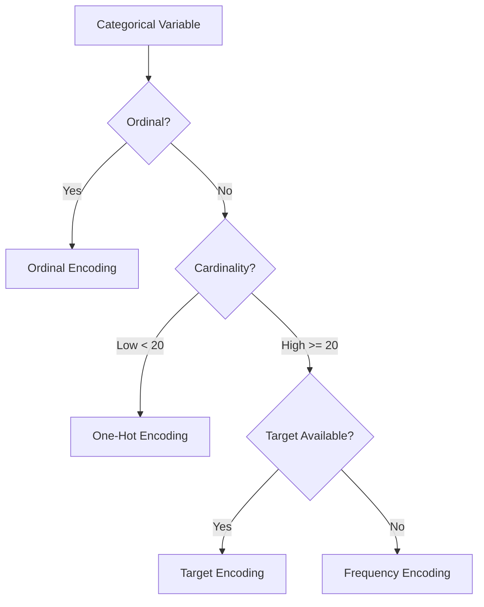

---
{"dg-publish":true,"permalink":"/stats/04-supervised-learning/encoding-categorical-variables/","tags":["probability","data-preprocessing","machine-learning","feature-engineering"]}
---


## Definition

> [!abstract] Core Statement
> **Encoding Categorical Variables** transforms ==non-numeric categories== into numerical representations that machine learning algorithms can process. The choice of encoding method significantly impacts model performance.

---

## Encoding Methods Overview

| Method | Cardinality | Preserves Order | Memory | Best For |
|--------|-------------|-----------------|--------|----------|
| **One-Hot** | Low (<20) | No | High | Tree models, Linear |
| **Label** | Any | If ordinal | Low | Trees, memory-constrained |
| **Target** | High | No | Low | High cardinality |
| **Frequency** | High | No | Low | High cardinality |
| **Binary** | Moderate | No | Moderate | Tree models |
| **Ordinal** | Any | Yes | Low | Ordinal categories |

---

## Python Implementation

```python
import pandas as pd
import numpy as np
from sklearn.preprocessing import LabelEncoder, OneHotEncoder, OrdinalEncoder
from category_encoders import TargetEncoder, BinaryEncoder

df = pd.DataFrame({
    'color': ['red', 'blue', 'green', 'red', 'blue'],
    'size': ['S', 'M', 'L', 'XL', 'M'],
    'city': ['NYC', 'LA', 'Chicago', 'NYC', 'Miami'],
    'target': [1, 0, 1, 1, 0]
})

# ========== 1. ONE-HOT ENCODING ==========
# Creates binary columns for each category
df_onehot = pd.get_dummies(df, columns=['color'], drop_first=True)
print("One-Hot:")
print(df_onehot)

# Sklearn version
ohe = OneHotEncoder(sparse_output=False, drop='first')
onehot_array = ohe.fit_transform(df[['color']])

# ========== 2. LABEL ENCODING ==========
# Maps categories to integers (0, 1, 2, ...)
le = LabelEncoder()
df['color_label'] = le.fit_transform(df['color'])
print(f"Label mapping: {dict(zip(le.classes_, le.transform(le.classes_)))}")

# ========== 3. ORDINAL ENCODING ==========
# For ordered categories
size_order = [['S', 'M', 'L', 'XL']]
oe = OrdinalEncoder(categories=size_order)
df['size_ordinal'] = oe.fit_transform(df[['size']])

# ========== 4. TARGET ENCODING ==========
# Replace category with mean of target (CAREFUL: leakage!)
from category_encoders import TargetEncoder

te = TargetEncoder(cols=['city'], smoothing=1.0)
df['city_target'] = te.fit_transform(df['city'], df['target'])

# ========== 5. FREQUENCY ENCODING ==========
freq = df['city'].value_counts(normalize=True)
df['city_freq'] = df['city'].map(freq)

# ========== 6. BINARY ENCODING ==========
be = BinaryEncoder(cols=['city'])
df_binary = be.fit_transform(df)
```

---

## R Implementation

```r
library(caret)
library(recipes)

# ========== ONE-HOT ENCODING ==========
dummy <- dummyVars(~ color, data = df)
df_onehot <- predict(dummy, newdata = df)

# ========== USING RECIPES ==========
recipe_obj <- recipe(target ~ ., data = df) %>%
  step_dummy(color, one_hot = TRUE) %>%
  step_ordinalscore(size) %>%
  step_lencode_mixed(city, outcome = vars(target))  # Target encoding

prepped <- prep(recipe_obj)
df_encoded <- bake(prepped, new_data = df)
```

---

## Choosing the Right Method



---

## Target Encoding Details

$$
\text{Encoded} = \frac{n \cdot \bar{y}_{category} + m \cdot \bar{y}_{global}}{n + m}
$$

Where:
- $n$ = count in category
- $m$ = smoothing parameter
- $\bar{y}_{category}$ = mean target in category
- $\bar{y}_{global}$ = global mean target

> [!warning] Target Leakage
> **Never** fit target encoder on full data before train/test split!
> Always fit on training data only.

---

## Common Pitfalls

> [!warning] Real-World Traps
>
> **1. One-Hot with High Cardinality**
> - *Problem:* 1000 categories = 1000 columns → curse of dimensionality
> - *Solution:* Use target/frequency encoding
>
> **2. Label Encoding for Non-Ordinal**
> - *Problem:* Model interprets 0 < 1 < 2 as ordered
> - *Solution:* Use one-hot for nominal categories
>
> **3. Target Encoding Leakage**
> - *Problem:* Fit on full data → overfitting
> - *Solution:* Fit only on training data, use cross-validation folds

---

## Related Concepts

- [[stats/04_Supervised_Learning/Feature Engineering\|Feature Engineering]] — Broader context
- [[stats/01_Foundations/Feature Scaling\|Feature Scaling]] — Often applied after encoding
- [[stats/04_Supervised_Learning/Curse of Dimensionality\|Curse of Dimensionality]] — One-hot creates many features
- [[stats/04_Supervised_Learning/CatBoost\|CatBoost]] — Native categorical handling

---

## References

- **Book:** Zheng, A., & Casari, A. (2018). *Feature Engineering for Machine Learning*. O'Reilly.
- **Package:** [category_encoders](https://contrib.scikit-learn.org/category_encoders/)
