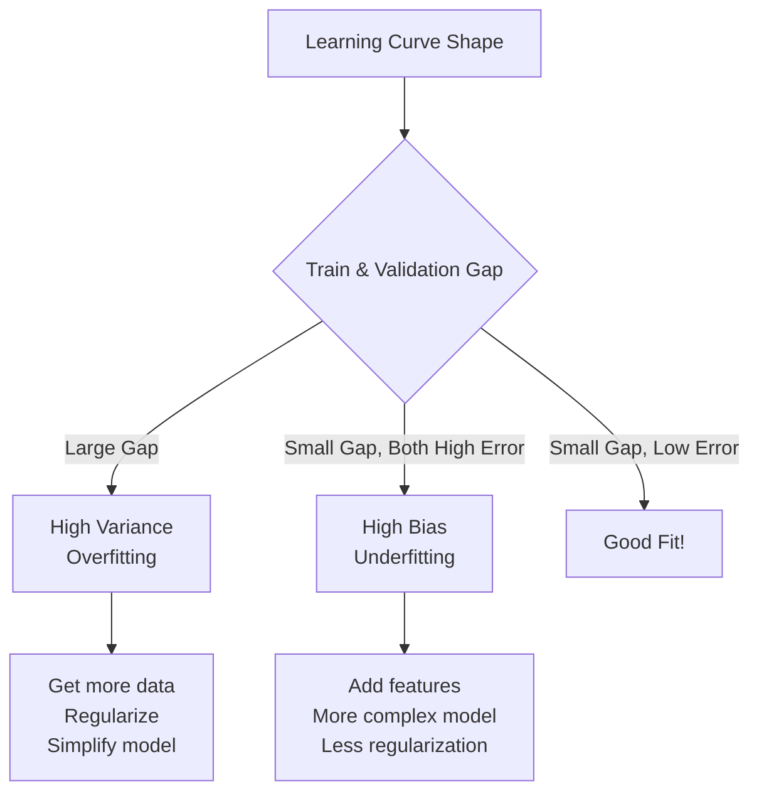

---
{"dg-publish":true,"permalink":"/stats/04-supervised-learning/learning-curves/","tags":["Machine-Learning","Model-Evaluation","Diagnostics"]}
---


## Definition

> [!abstract] Core Statement
> **Learning Curves** plot model performance (e.g., accuracy, loss) against ==training set size or training iterations==. They diagnose whether a model suffers from high bias (underfitting) or high variance (overfitting).

---

> [!tip] Intuition (ELI5): The Student's Progress
> A learning curve is like tracking a student's test scores as they study more. If scores plateau early, they're not learning enough (underfitting). If practice test scores are great but real tests are bad, they're memorizing (overfitting).

---

## Types of Learning Curves

### 1. Training Size Curve
Shows how performance changes as you add more training data.

### 2. Iteration Curve
Shows how loss decreases over training epochs (common in deep learning).

---

## Diagnosing Problems



---

## Python Implementation

```python
import numpy as np
import matplotlib.pyplot as plt
from sklearn.model_selection import learning_curve, validation_curve
from sklearn.ensemble import RandomForestClassifier

# ========== LEARNING CURVE (TRAINING SIZE) ==========
train_sizes, train_scores, val_scores = learning_curve(
    estimator=RandomForestClassifier(n_estimators=100, random_state=42),
    X=X,
    y=y,
    train_sizes=np.linspace(0.1, 1.0, 10),  # 10% to 100%
    cv=5,
    scoring='accuracy',
    n_jobs=-1
)

# Calculate mean and std
train_mean = train_scores.mean(axis=1)
train_std = train_scores.std(axis=1)
val_mean = val_scores.mean(axis=1)
val_std = val_scores.std(axis=1)

# Plot
plt.figure(figsize=(10, 6))
plt.plot(train_sizes, train_mean, 'o-', label='Training Score', color='blue')
plt.fill_between(train_sizes, train_mean - train_std, train_mean + train_std, 
                 alpha=0.1, color='blue')
plt.plot(train_sizes, val_mean, 'o-', label='Validation Score', color='green')
plt.fill_between(train_sizes, val_mean - val_std, val_mean + val_std, 
                 alpha=0.1, color='green')
plt.xlabel('Training Set Size')
plt.ylabel('Accuracy')
plt.title('Learning Curve')
plt.legend(loc='lower right')
plt.grid(True, alpha=0.3)
plt.show()

# ========== VALIDATION CURVE (HYPERPARAMETER) ==========
param_range = [1, 2, 5, 10, 20, 50, 100, 200]
train_scores, val_scores = validation_curve(
    estimator=RandomForestClassifier(random_state=42),
    X=X,
    y=y,
    param_name='n_estimators',
    param_range=param_range,
    cv=5,
    scoring='accuracy',
    n_jobs=-1
)

# Plot
plt.figure(figsize=(10, 6))
plt.semilogx(param_range, train_scores.mean(axis=1), 'o-', label='Training', color='blue')
plt.semilogx(param_range, val_scores.mean(axis=1), 'o-', label='Validation', color='green')
plt.xlabel('n_estimators')
plt.ylabel('Accuracy')
plt.title('Validation Curve')
plt.legend()
plt.grid(True, alpha=0.3)
plt.show()
```

---

## Interpretation Guide

### High Bias (Underfitting)


| Symptom | Meaning | Solution |
|---------|---------|----------|
| Both curves converge to low score | Model too simple | Add features, increase complexity |
| Gap is small | Low variance | Use polynomial features, more layers |
| More data doesn't help | Can't learn more | Try different algorithm |

### High Variance (Overfitting)

| Symptom | Meaning | Solution |
|---------|---------|----------|
| Training score >> Validation score | Too complex | Regularization, dropout |
| Gap narrows with more data | Need more data | Data augmentation |
| Validation oscillates | Unstable | Cross-validation, ensemble |

### Good Fit

| Symptom | Meaning |
|---------|---------|
| Both curves converge to high score | Ideal! |
| Small gap between curves | Good generalization |
| Stable as data increases | Robust model |

---

## R Implementation

```r
library(caret)
library(ggplot2)

# ========== LEARNING CURVE ==========
# Generate curves manually
train_sizes <- seq(0.1, 1, by = 0.1)
results <- data.frame()

for (frac in train_sizes) {
  n <- floor(frac * nrow(train_data))
  train_subset <- train_data[1:n, ]
  
  ctrl <- trainControl(method = "cv", number = 5)
  model <- train(target ~ ., data = train_subset, method = "rf", trControl = ctrl)
  
  results <- rbind(results, data.frame(
    size = n,
    train_acc = max(model$results$Accuracy),
    cv_acc = mean(model$results$Accuracy)
  ))
}

# Plot
ggplot(results, aes(x = size)) +
  geom_line(aes(y = train_acc, color = "Training")) +
  geom_line(aes(y = cv_acc, color = "Validation")) +
  labs(title = "Learning Curve", x = "Training Size", y = "Accuracy") +
  theme_minimal()
```

---

## Deep Learning: Loss Curves

```python
import matplotlib.pyplot as plt

# After training a neural network with history
history = model.fit(X_train, y_train, validation_data=(X_val, y_val), epochs=100)

# ========== PLOT LOSS ==========
plt.figure(figsize=(12, 4))

plt.subplot(1, 2, 1)
plt.plot(history.history['loss'], label='Training Loss')
plt.plot(history.history['val_loss'], label='Validation Loss')
plt.xlabel('Epoch')
plt.ylabel('Loss')
plt.legend()
plt.title('Loss Curve')

plt.subplot(1, 2, 2)
plt.plot(history.history['accuracy'], label='Training Accuracy')
plt.plot(history.history['val_accuracy'], label='Validation Accuracy')
plt.xlabel('Epoch')
plt.ylabel('Accuracy')
plt.legend()
plt.title('Accuracy Curve')

plt.tight_layout()
plt.show()
```

---

## Common Pitfalls

> [!warning] Real-World Traps
>
> **1. Ignoring Confidence Intervals**
> - *Problem:* Curves look close but overlap within noise
> - *Solution:* Always show std bands with cross-validation
>
> **2. Wrong Metric**
> - *Problem:* Accuracy for imbalanced data
> - *Solution:* Use F1, AUC-ROC for appropriate problems
>
> **3. Too Few Data Points**
> - *Problem:* Curve is noisy and hard to interpret
> - *Solution:* Use more CV folds or repeated CV

---

## Related Concepts

- [[stats/04_Supervised_Learning/Overfitting\|Overfitting]] — What high variance looks like
- [[stats/04_Supervised_Learning/Underfitting\|Underfitting]] — What high bias looks like
- [[stats/04_Supervised_Learning/Cross-Validation\|Cross-Validation]] — Used to generate curves
- [[stats/04_Supervised_Learning/Hyperparameter Tuning\|Hyperparameter Tuning]] — Uses validation curves

---

## References

- **Book:** Hastie, T., Tibshirani, R., & Friedman, J. (2009). *The Elements of Statistical Learning* (2nd ed.). [Free PDF](https://web.stanford.edu/~hastie/ElemStatLearn/)
- **Scikit-learn:** [Learning Curve Documentation](https://scikit-learn.org/stable/modules/learning_curve.html)
