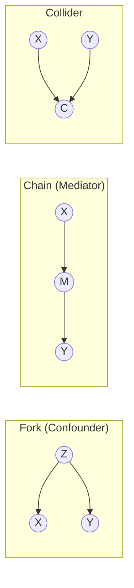
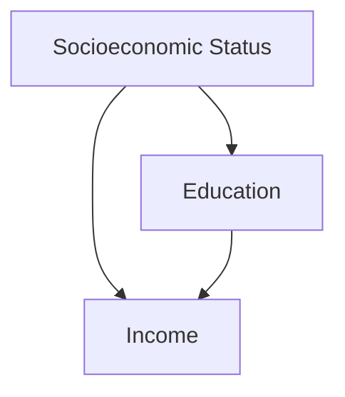
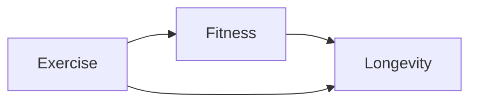
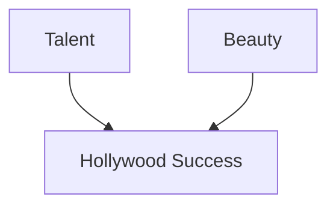

---
{"dg-publish":true,"permalink":"/stats/07-causal-inference/da-gs-for-causal-inference/","tags":["causal-inference","statistics","graph-theory"]}
---


## Definition

> [!abstract] Core Statement
> A **Directed Acyclic Graph (DAG)** is a visual representation of causal assumptions, showing ==directed arrows== from causes to effects with no cycles. DAGs help identify **confounders**, **colliders**, and valid **adjustment sets** for causal inference.


---

> [!tip] Intuition (ELI5): The Family Tree of Causes
> Think of a DAG like a family tree, but for causes and effects. If A causes B, there's an arrow from A to B. You can trace the "family lineage" of any outcome back to its causes. The rule: you can never go in circles (no time travel!).

---

## Purpose

1. **Make Assumptions Explicit:** Force researchers to state causal beliefs
2. **Identify Confounders:** Find variables that create spurious associations
3. **Identify Colliders:** Find variables that, if conditioned on, create bias
4. **Find Adjustment Sets:** Determine which variables to control for
5. **Avoid Bad Controls:** Prevent controlling for mediators or colliders

---

## Key Concepts

### 1. Nodes and Edges

| Element | Meaning |
|---------|---------|
| **Node (circle)** | A variable (observed or unobserved) |
| **Arrow (edge)** | Direct causal effect from parent to child |
| **Path** | Sequence of edges connecting two nodes |

### 2. Types of Paths



| Path Type | Structure | If you control for middle variable... |
|-----------|-----------|--------------------------------------|
| **Fork** | X ← Z → Y | Blocks spurious path ✓ |
| **Chain** | X → M → Y | Blocks causal path (usually bad!) |
| **Collider** | X → C ← Y | Opens spurious path (bad!) |

### 3. Confounders and Colliders

> [!warning] Confounder vs Collider
> **Confounder (Z):** Common cause of X and Y. Must control for it.
> **Collider (C):** Common effect of X and Y. Must NOT control for it.

---

## D-Separation Rules

Two variables X and Y are **d-separated** given Z if all paths between them are blocked:

1. **Fork is blocked** if you condition on the middle node
2. **Chain is blocked** if you condition on the middle node
3. **Collider is blocked** by default, but **opens** if you condition on it (or its descendants)

### Finding Valid Adjustment Sets

To estimate the causal effect of X on Y:
1. Find all "backdoor paths" from X to Y
2. Block all backdoor paths by conditioning
3. Don't block the causal path
4. Don't condition on colliders or descendants of treatment

---

## Python Implementation

```python
# Using the 'pgmpy' or 'dowhy' library
import networkx as nx
import matplotlib.pyplot as plt

# ========== CREATE DAG ==========
G = nx.DiGraph()

# Example: Coffee → Alertness → Productivity
#                      ↑
#          Sleep Quality
G.add_edges_from([
    ('Sleep', 'Alertness'),
    ('Coffee', 'Alertness'),
    ('Alertness', 'Productivity'),
    ('Sleep', 'Productivity')  # Direct effect
])

# ========== VISUALIZE ==========
pos = {
    'Sleep': (0, 1),
    'Coffee': (0, 0),
    'Alertness': (1, 0.5),
    'Productivity': (2, 0.5)
}

plt.figure(figsize=(10, 6))
nx.draw(G, pos, with_labels=True, node_size=3000, 
        node_color='lightblue', font_size=12, 
        arrows=True, arrowsize=20)
plt.title('Causal DAG: Coffee and Productivity')
plt.show()

# ========== USING DOWHY ==========
import dowhy
from dowhy import CausalModel

# Define causal graph in GML format
causal_graph = """
digraph {
    Sleep -> Alertness;
    Coffee -> Alertness;
    Alertness -> Productivity;
    Sleep -> Productivity;
}
"""

# Create model
model = CausalModel(
    data=df,  # Your dataframe
    treatment='Coffee',
    outcome='Productivity',
    graph=causal_graph
)

# Identify causal effect
identified_estimand = model.identify_effect()
print(identified_estimand)

# Estimate effect
estimate = model.estimate_effect(
    identified_estimand,
    method_name="backdoor.linear_regression"
)
print(f"Causal Effect: {estimate.value}")
```

---

## R Implementation

```r
library(dagitty)
library(ggdag)

# ========== CREATE DAG ==========
dag <- dagitty('dag {
    Sleep -> Alertness
    Coffee -> Alertness
    Alertness -> Productivity
    Sleep -> Productivity
}')

# ========== VISUALIZE ==========
ggdag(dag, layout = "sugiyama") +
  theme_dag() +
  labs(title = "Causal DAG: Coffee and Productivity")

# ========== FIND ADJUSTMENT SETS ==========
# What to control for to estimate Coffee -> Productivity?
adjustmentSets(dag, exposure = "Coffee", outcome = "Productivity")
# Answer: { Sleep } - control for Sleep

# ========== CHECK D-SEPARATION ==========
# Are Coffee and Sleep d-separated given Alertness?
dseparated(dag, "Coffee", "Sleep", "Alertness")
# FALSE - conditioning on Alertness opens the path through the collider!

# ========== FIND ALL PATHS ==========
paths(dag, from = "Coffee", to = "Productivity")
```

---

## Classic DAG Patterns

### 1. The Confounder



**Problem:** Naive regression of Income on Education is biased.
**Solution:** Control for Socioeconomic Status.

### 2. The Mediator



**Problem:** If you control for Fitness, you block part of the causal effect.
**Solution:** Don't control for mediators when estimating total effect.

### 3. The Collider (Selection Bias)



**Problem:** Among Hollywood actors, talent and beauty might appear negatively correlated (collider bias).
**Solution:** Don't condition on success when studying the talent-beauty relationship.

---

## Common Pitfalls

> [!warning] Real-World Traps
>
> **1. Conditioning on Colliders**
> - *Problem:* Creates spurious association
> - *Example:* "Among hospitalized patients, disease A and disease B seem correlated" (but only because both cause hospitalization)
>
> **2. Conditioning on Mediators**
> - *Problem:* Blocks the causal path you want to measure
> - *Example:* "Control for blood pressure when studying salt → heart disease"
>
> **3. Unmeasured Confounders**
> - *Problem:* Can't control for what you don't measure
> - *Solution:* Use [[stats/07_Causal_Inference/Instrumental Variables (IV)\|Instrumental Variables (IV)]] or sensitivity analysis
>
> **4. Overcontrolling**
> - *Problem:* Including too many variables can bias estimates
> - *Solution:* Use DAG to determine minimal sufficient adjustment set

---

## The Backdoor Criterion

Pearl's **Backdoor Criterion** identifies valid adjustment sets:

A set Z satisfies the backdoor criterion relative to (X, Y) if:
1. No node in Z is a descendant of X
2. Z blocks every path between X and Y that contains an arrow into X

---

## Related Concepts

**Prerequisites:**
- [[stats/01_Foundations/Conditional Probability\|Conditional Probability]] — Foundation for d-separation
- [[stats/01_Foundations/Confounding Variables\|Confounding Variables]] — Why we need DAGs

**Core Methods:**
- [[stats/07_Causal_Inference/Propensity Score Matching (PSM)\|Propensity Score Matching (PSM)]] — Estimation after adjustment
- [[stats/07_Causal_Inference/Instrumental Variables (IV)\|Instrumental Variables (IV)]] — When confounders are unmeasured
- [[stats/07_Causal_Inference/Difference-in-Differences\|Difference-in-Differences]] — Panel data approach

**Extensions:**
- Structural Equation Models (SEM)
- [[Mediation & Moderation Analysis\|Mediation & Moderation Analysis]] — Path analysis

---

## References

- **Book:** Pearl, J. (2009). *Causality: Models, Reasoning, and Inference* (2nd ed.). Cambridge University Press. [Publisher Link](https://www.cambridge.org/core/books/causality/B0046844FAE10CBF274D4ACBDAEB5F5B)
- **Book:** Hernán, M. A., & Robins, J. M. (2020). *Causal Inference: What If*. Chapman & Hall. [Free Online](https://www.hsph.harvard.edu/miguel-hernan/causal-inference-book/)
- **Article:** Greenland, S., Pearl, J., & Robins, J. M. (1999). Causal diagrams for epidemiologic research. *Epidemiology*, 10(1), 37-48.
- **Tool:** [DAGitty - Draw and Analyze DAGs](http://www.dagitty.net/)
