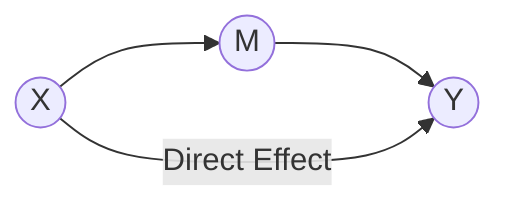
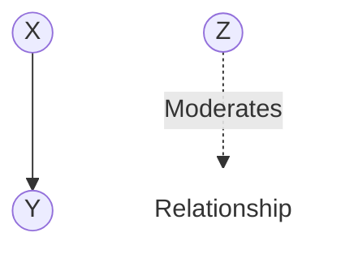

---
{"dg-publish":true,"permalink":"/stats/07-causal-inference/mediation-and-moderation-analysis/","tags":["Causal-Inference","Statistics","Mechanisms"]}
---


## Definition

> [!abstract] Core Statement
> **Mediation Analysis** investigates the ==mechanism== (the "how") through which an independent variable affects a dependent variable. 
> **Moderation Analysis** investigates the ==context== (the "when") under which an independent variable affects a dependent variable.

---

## 1. Mediation: The Mechanism

Mediation asks: **Does X lead to M, which then leads to Y?**

> [!tip] Intuition (ELI5): The Sleepy Student
> - **X (Predictor):** Drinking coffee.
> - **Y (Outcome):** Good exam scores.
> - **M (Mediator):** Staying awake.
> Coffee (X) helps you score well (Y) *because* it keeps you awake (M). If coffee didn't keep you awake, it might not help your score.

### Effects in Mediation
- **Direct Effect:** The effect of X on Y while holding M constant.
- **Indirect Effect:** The effect of X on Y that flows *through* M.
- **Total Effect:** Direct + Indirect.

---

## 2. Moderation: The Context

Moderation asks: **Does the relationship between X and Y change depending on Z?**

> [!tip] Intuition (ELI5): The Sunburn
> - **X (Predictor):** Time spent in the sun.
> - **Y (Outcome):** Sunburn severity.
> - **Z (Moderator):** Sunscreen.
> If you wear sunscreen (Z), the effect of the sun (X) on your skin (Y) is small. If you don't, the effect is large. Sunscreen *moderates* the relationship.

---

## Path Diagrams (DAGs)

### Mediation


### Moderation


---

## Python Example (Conceptual)

Using `statsmodels` or `pingouin`:

```python
import pingouin as pg
import pandas as pd

# Load or Create Data
df = pd.DataFrame({
    'coffee': [1, 2, 3, 4, 5],
    'awake':  [2, 3, 4, 5, 6],
    'score':  [60, 70, 80, 90, 100]
})

# Mediation (X=coffee, M=awake, Y=score)
res = pg.mediation_analysis(data=df, x='coffee', m='awake', y='score', seed=42)
print(res)

# Moderation (X*Z Interaction)
# Usually done via standard regression: y ~ x*z
import statsmodels.formula.api as smf
model = smf.ols("score ~ coffee * sunscreen", data=df_mod).fit()
```
