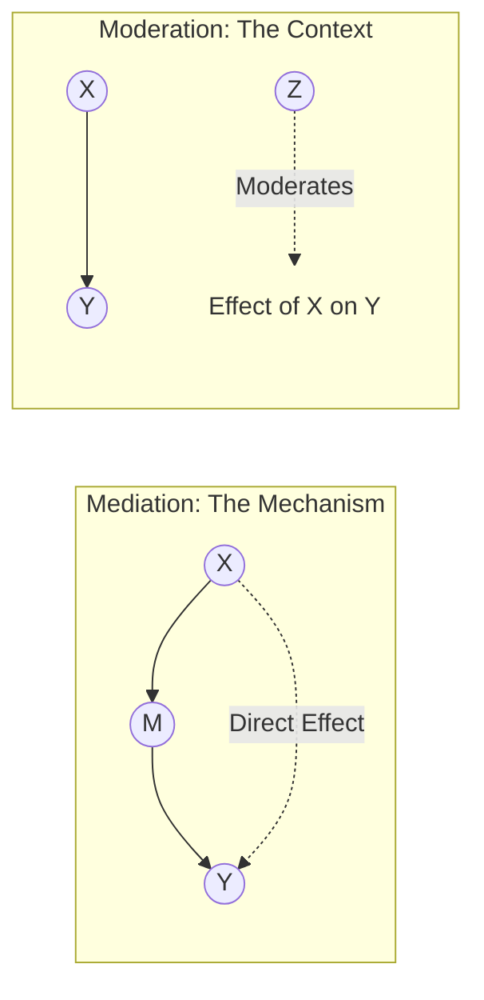

---
{"dg-publish":true,"permalink":"/stats/07-causal-inference/moderation-vs-mediation/","tags":["causal-inference","statistics","mechanisms"]}
---


## Definition

> [!abstract] Core Statement
> - **Mediation** explains ==HOW== or ==WHY== a relationship occurs (Process/Mechanism).
> - **Moderation** explains ==WHEN== or ==FOR WHOM== a relationship occurs (Context/Condition).

---

## Visual Comparison



---

## 1. Mediation: The Mechanism

Mediation asks: **Does X lead to M, which then leads to Y?**

> [!tip] Intuition: The Sleepy Student
> - **X (Predictor):** Drinking coffee
> - **Y (Outcome):** Good exam scores
> - **M (Mediator):** Staying awake
> 
> Coffee (X) helps you score well (Y) *because* it keeps you awake (M). If coffee didn't keep you awake, it wouldn't help. The effect flows **through** M.

### Statistical Test (Sobel)
We test if the indirect path ($a \times b$) is significant.

$$ \text{Total Effect (c)} = \text{Direct Effect (c')} + \text{Indirect Effect (ab)} $$

---

## 2. Moderation: The Context

Moderation asks: **Does the strength of the X → Y relationship depend on Z?**

> [!tip] Intuition: The Sunburn
> - **X (Predictor):** Time in sun
> - **Y (Outcome):** Sunburn severity
> - **Z (Moderator):** Sunscreen usage
> 
> The effect of sun (X) on burn (Y) **depends on** whether you wear sunscreen (Z). Sunscreen *moderates* the damage.

### Statistical Test (Interaction)
We test if the interaction term ($X \times Z$) is significant in a regression.

$$ Y = \beta_0 + \beta_1 X + \beta_2 Z + \beta_3 (X \times Z) + \epsilon $$

---

## Key Differences Summary

| Feature | Mediation | Moderation |
|---------|-----------|------------|
| **Question** | "How does it work?" | "When does it work?" |
| **Variable Role** | Intermediate step | Context/Condition |
| **Causal Chain** | $X \to M \to Y$ | $X \to Y$ strength varies by $Z$ |
| **Statistical Test** | Path Analysis / Process | Interaction Term ($X \times Z$) |

---

## Python Implementation

```python
import pingouin as pg
import statsmodels.formula.api as smf
import pandas as pd

# ========== MEDIATION ANALYSIS ==========
# Does 'awake' mediate the effect of 'coffee' on 'score'?
# med_res = pg.mediation_analysis(data=df, x='coffee', m='awake', y='score')
# print(med_res)

# ========== MODERATION ANALYSIS ==========
# Does 'sunscreen' moderate the effect of 'sun_time' on 'burn'?
# We just add an interaction term (*)
model = smf.ols("burn ~ sun_time * sunscreen", data=df).fit()
print(model.summary())

# Check the p-value for 'sun_time:sunscreen'. 
# If < 0.05, moderation is present.
```

---

## Sobel Test (Manual Calculation)

If libraries aren't available, you can calculate the significance of mediation manually:

```python
from scipy import stats
import numpy as np

# Coefficients from regressions
a = 0.5   # X -> M
b = 0.3   # M -> Y (controlling for X)
se_a = 0.1
se_b = 0.1

# Sobel Z-score
sobel_se = np.sqrt(b**2 * se_a**2 + a**2 * se_b**2)
z = (a * b) / sobel_se
p_value = 2 * (1 - stats.norm.cdf(abs(z)))

print(f"Indirect Effect Z: {z:.2f}, p-value: {p_value:.4f}")
```

---

## Related Concepts

- [[stats/07_Causal_Inference/Causal Inference\|Causal Inference]] — The broader framework
- [[stats/03_Regression_Analysis/Interaction Effects\|Interaction Effects]] = Moderation
- [[stats/07_Causal_Inference/DAGs for Causal Inference\|DAGs for Causal Inference]] — How to draw these relationships
- [[stats/01_Foundations/Confounding Variables\|Confounding Variables]] — Z affects both X and Y (different from M or Z here)

---

## References

- **Paper:** Baron, R. M., & Kenny, D. A. (1986). The moderator–mediator variable distinction. *JPSP*.
- **Book:** Hayes, A. F. (2017). *Introduction to Mediation, Moderation, and Conditional Process Analysis*. Guilford Press.
