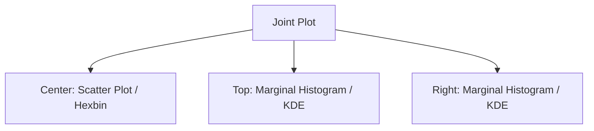

---
{"dg-publish":true,"permalink":"/stats/09-eda-and-visualization/joint-plot/","tags":["Visualization","Multivariate","Bivariate"]}
---


## Definition

> [!abstract] Core Statement
> A **Joint Plot** combines a bivariate visualization (usually a **Scatter Plot**) with univariate marginal distributions (**Histograms** or **KDEs**) along the axes. It allows for simultaneous analysis of the relationship between two variables and their individual distributions.



---

## Why use a Joint Plot?

1.  **Spot Outliers in Both Views:** A point might look like an outlier in the scatter plot but perfectly normal in a marginal distribution (or vice versa).
2.  **Assess Density:** In overplotted scatter plots, the marginal KDE/Hist helps identify where the bulk of the data lies.
3.  **Correlation + Distribution:** You can see *how* two variables relate (correlation) and *what* their shapes are (skewness, modality) in one glance.

---

## Python Implementation (Seaborn)

Seaborn's `jointplot` is the industry standard for this visualization.

```python
import seaborn as sns
import matplotlib.pyplot as plt

# Load example data
tips = sns.load_dataset("tips")

# Create Joint Plot
sns.jointplot(data=tips, x="total_bill", y="tip", kind="reg")

plt.show()
```

### Common `kind` flavors:
- `scatter`: Standard points.
- `reg`: Scatter + Linear Regression fit.
- `hex`: Hexagonal binning (better for large datasets).
- `kde`: 2D Kernel Density Estimate (contour plot).

---

## Limitations

> [!warning] Real Estate
> Joint plots take up significant screen space. In a dashboard with many plots, a simple scatter plot with a caption describing the distribution is often preferred.

---

## Related Concepts

- [[stats/09_EDA_and_Visualization/Scatter Plot\|Scatter Plot]] - The core of the joint plot.
- [[stats/09_EDA_and_Visualization/Density Plot (KDE)\|Density Plot (KDE)]] - Frequently used for the margins.
- [[stats/01_Foundations/Correlation Analysis\|Correlation Analysis]] - Often the reason for creating a joint plot.

---

## References

- **Documentation:** [Seaborn Jointplot Documentation](https://seaborn.pydata.org/generated/seaborn.jointplot.html)
- **Book:** Waskom, M. L. (2021). seaborn: statistical data visualization. *Journal of Open Source Software*.
