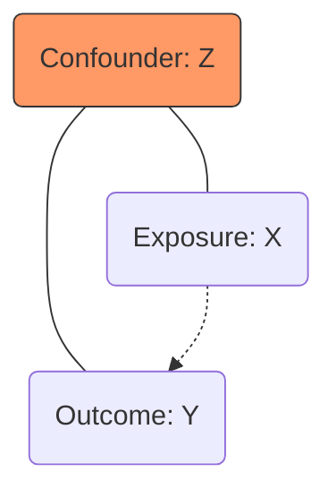

---
{"dg-publish":true,"permalink":"/stats/10-ethics-and-biases/confounding-bias/","tags":["Critical-Thinking","Causality","Regression","Study-Design"]}
---

## Definition

> [!abstract] Core Statement
> **Confounding Bias** occurs when an unobserved or uncorrected variable (a **confounder**) is associated with both the independent variable (exposure) and the dependent variable (outcome). This creates a "spurious" correlation, making it seem like $X \to Y$ when actually $Z \to X$ and $Z \to Y$.


---

> [!tip] Intuition (ELI5): The "Lighter" Mystery
> People who carry **lighters** are more likely to get lung cancer. Does the lighter cause it? No! It's because people who carry lighters usually **smoke**. Smoking is the "blind spot" (confounder) that makes the lighter look guilty when it's actually innocent.

> [!example] Real-Life Example: Coffee and Heart Disease
> Early studies linked coffee to heart disease. However, they didn't account for the fact that heavy coffee drinkers at the time were also more likely to be **heavy smokers**. Once smoking was "controlled for," the coffee-heart disease link disappeared.

---

## Purpose

1.  **Causal Inference:** Distinguishing between "Correlation" and "Causality."
2.  **Model Improvement:** Identifying which control variables must be included in a regression to avoid **Omitted Variable Bias**.
3.  **Study Design:** Using techniques like Randomization or Matching to break the link between confounders and exposures.

---

## The Confounding Triangle



> [!example] Ice Cream vs. Drowning
> - **X:** Ice Cream Sales
> - **Y:** Drowning Incidents
> - **Z (Confounder):** **Temperature / Summer**
> High temperature causes people to eat ice cream AND swim more. Ice cream does not cause drowning.

---

## Dealing with Confounders

| Method | Timing | How it works |
| :--- | :--- | :--- |
| **Randomization** | Study Design | Randomly assigns X, ensuring Z is distributed equally. |
| **Matching** | Study Design | Pairs similar individuals (same Z) but different X. |
| **Stratification** | Analysis | Analyzing subgroups where Z is constant (e.g., analyze only Summer data). |
| **Multivariate Regression** | Analysis | Including Z as a predictor to "control" for its effect. |

---

## Theoretical Background: The Back-Door Criterion

In **Causal Diagrams (DAGs)**, a confounder creates a "back-door path" between $X$ and $Y$. To find the true causal effect, you must "block" all back-door paths by conditioning on the confounders.

---

## Python Simulation: Controlling for a Confounder

```python
import numpy as np
import statsmodels.api as sm
import pandas as pd

# Scenario: Does "Education (X)" cause "Income (Y)"?
# Confounder: "Ability/IQ (Z)" affects both.
n = 1000
ability = np.random.normal(100, 15, n)

# Education depends on Ability
edu_years = 10 + 0.05 * ability + np.random.normal(0, 2, n)

# Income depends on BOTH
income = 20000 + 1000 * edu_years + 500 * ability + np.random.normal(0, 5000, n)

# 1. BIASED Regression (Ignore Confounder)
model_biased = sm.OLS(income, sm.add_constant(edu_years)).fit()
print(f"Biased Coefficient (Edu): {model_biased.params[1]:.2f}")
# Usually overestimates the effect significantly.

# 2. CORRECTED Regression (Control for Ability)
model_correct = sm.OLS(income, sm.add_constant(pd.DataFrame({'Edu': edu_years, 'Ability': ability}))).fit()
print(f"Corrected Coefficient (Edu): {model_correct.params['Edu']:.2f}")
# Returns much closer to the true value (1000).
```

---

## Related Concepts

- [[stats/10_Ethics_and_Biases/Simpson's Paradox\|Simpson's Paradox]] - A result of confounding.
- [[stats/03_Regression_Analysis/Multiple Linear Regression\|Multiple Linear Regression]] - The primary tool for control.
- [[stats/01_Foundations/Randomized Controlled Trials\|Randomized Controlled Trials]]
 - The gold standard to eliminate confounding.

---

## References

- **Book:** Pearl, J., & Mackenzie, D. (2018). *The Book of Why*. Basic Books. [Author Site](http://bayes.cs.ucla.edu/WHY/)
- **Book:** Angrist, J. D., & Pischke, J. S. (2009). *Mostly Harmless Econometrics*. Princeton University Press. [Publisher](https://www.mostlyharmlesseconometrics.com/)
- **Article:** McNamee, R. (2003). Confounding and confounders. *Occupational and Environmental Medicine*. [BMJ Link](https://oem.bmj.com/content/60/3/227)
